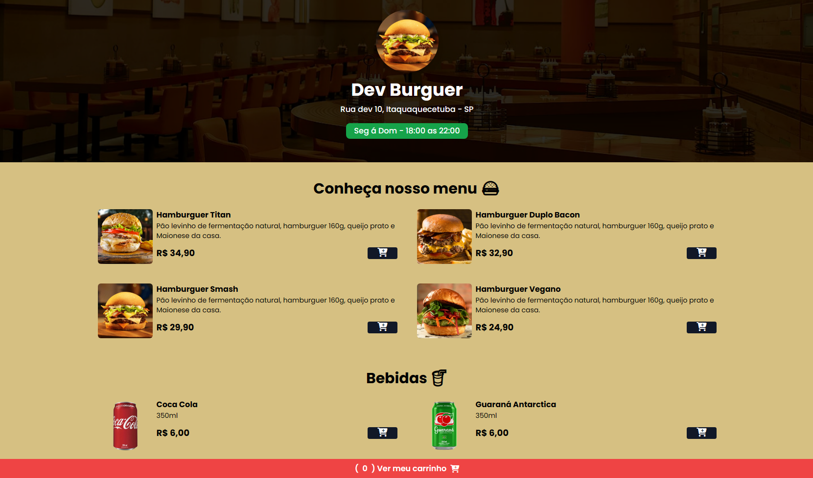
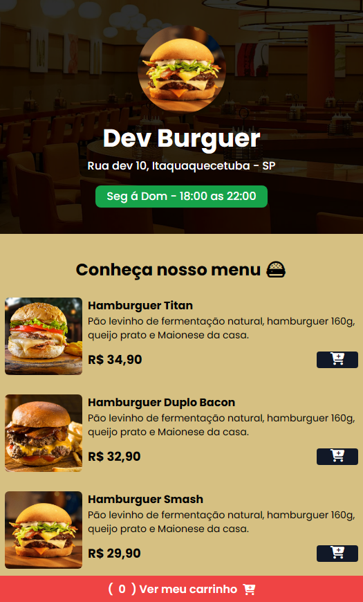

<h1 align="center" style="font-weight: bold;">Cardapio-Online 🍔</h1>

    <b>Este é um projeto de cardápio online desenvolvido utilizando HTML, CSS, JavaScript e Tailwind CSS.</b>

    <a href="#desktop">Desktop View</a> •
    <a href="#mobile">Mobile View</a> •
    <a href="#technologies">Tecnologias</a> 

<h2 id="layout">🎨 Layout</h2>

    <h3 align="center" id="desktop" style="font-weight: bold;">Desktop View 💻</h3>
    
    <h3 align="center" id="mobile" style="font-weight: bold;">Mobile View 📱</h3>
    

<h2 id="technologies">💻 Tecnologia</h2>

- HTML
- CSS
- Tailwind CSS
- JavaScript
